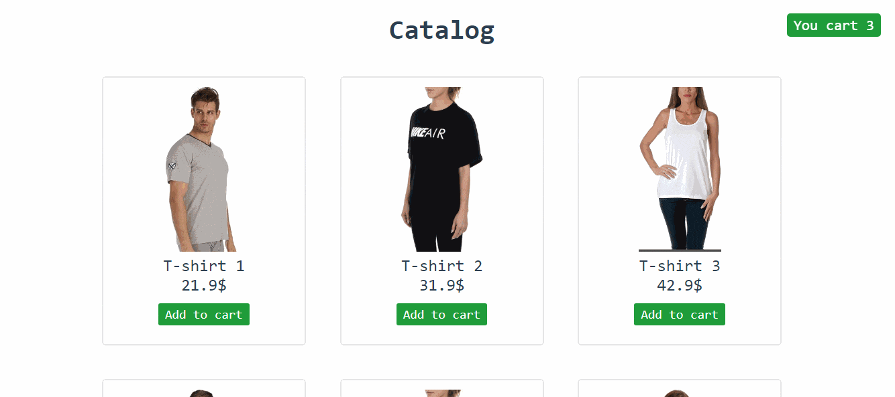

<h2 align="center">Vue Shop</h2>



Для создания Vue Shop я использовал Vue CLI, Vuex, Axios, Vue-router и SCSS ([package.json](/package.json))

master - ветка с исходниками

gh-pages - ветка с деплоем vue

Ссылка на сайт - [посмотреть на сайт](https://alexeysay.github.io/vue_shop/)

<h2 align="center">Установка </h2>

### Установка репозитория
```
git clone https://github.com/AlexeySay/vue_shop.git
```

### Настройка
```
npm install
```

### Компилирует и перезагружает
```
npm run serve
```

### Для работы json
```
json-server --watch db.json
```

### Компилирует и сжимает для продакшена
```
npm run build
```

### Ссылки и исправления файлов
```
npm run lint
```

### Customize configuration
See [Configuration Reference](https://cli.vuejs.org/config/).

---
Thanks for reading
<div style="margin: 0 auto">

</div>
